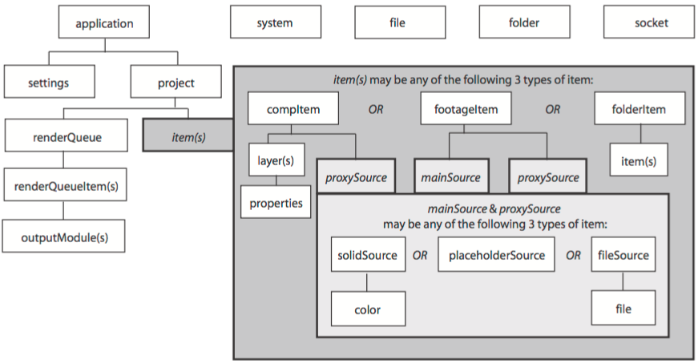

The After Effects Object Model
------------------------------

As you look through this reference section, which is organized alphabetically by object, you can refer to the following diagrams for an overview of where the various objects fall within the hierarchy, and their correspondence to the user interface.

Hierarchy diagram of the main After Effects scripting objects

Note that the File, Folder, and Socket objects are defined by ExtendScript, and are documented in the JavaScript Tools Guide. ExtendScript also defines the ScriptUI module, a set of window and user-interface control objects, which are available to After Effects scripts. These are also documented in the JavaScript Tools Guide. The hierarchy of objects in scripting corresponds to the hierarchy in the user interface.

.. image:: _static/application.png
   :alt: After Effects User Interface

The application contains a Project panel, which displays a project. The project contains compositions, which contain layers. The source for a layer can be a footage file, placeholder, or solid, also listed in the Project panel. Each layer contains settings known as properties, and these can contain markers and keyframes. The renderqueue contains render-queue items as well as render settings and output modules. All of these entities are represented by objects in scripting.

.. note::
   To avoid ambiguity, this manual uses the term "attribute" to refer to JavaScript object properties, and the term "property" or "AE property" to refer to After Effects layer properties.

**Object summary**

The following table lists all objects alphabetically, with links to the documentation page for each.

========================  =====================================================
Object                    Description
========================  =====================================================
:ref:`Globals`            Globally available functions that allow you to
                          display text for script debugging purposes, and help
                          convert time values between seconds and frames.
:ref:`Application`        A single global object, available by its name (app),
                          that provides access to objects and application
                          settings within the After Effects application.
:ref:`AVItem`             Represents audio/visual files imported into After
                          Effects.
:ref:`AVLayer`            Represents those layers that contain AVItem objects
                          (composition layers, footage layers, solid layers,
                          text layers, and sound layers).
:ref:`CameraLayer`        Represents a camera layer within a composition.
:ref:`Collection`         Associates a set of objects or values as a logical
                          group and provides access to them by index.
:ref:`CompItem`           Represents a composition, and allows you to
                          manipulate it and get information about it.
:ref:`FileSource`         Describes footage that comes from a file.
:ref:`FolderItem`         Represents a folder in the Project panel.
:ref:`FootageItem`        Represents a footage item imported into a project,
                          which appears in the Project panel.
:ref:`FootageSource`      Describes the file source of some footage.
:ref:`ImportOptions`      Encapsulates options for importing files into After
                          Effects.
:ref:`Item`               Represents an item in a project that appears in the
                          Project panel.
:ref:`ItemCollection`     Collects items in a project.
:ref:`KeyframeEase`       Encapsulates keyframe ease values in an After Effects
                          property.
:ref:`Layer`              A base class for layer classes.
:ref:`LayerCollection`    Collects layers in a project.
:ref:`LightLayer`         Represents a light layer within a composition.
:ref:`MarkerValue`        Encapsulates marker values in an After Effects
                          property.
:ref:`MaskPropertyGroup`  Encapsulates mask attributes in a layer.
:ref:`OMCollection`       Collects output modules in a render queue.
:ref:`OutputModule`       Represents an output module for a render queue.
:ref:`PlaceholderSource`  Describes a placeholder for footage.
:ref:`Project`            Represents an After Effects project.
:ref:`Property`           Represents an After Effects property.
:ref:`PropertyBase`       A base class for After Effects property and property
                          group classes.
:ref:`PropertyGroup`      Represents an After Effects property group.
:ref:`RenderQueue`        Represents the After Effects render queue.
:ref:`RenderQueueItem`    Represents a renderable item in a render queue.
:ref:`RenderQueueItem`    Collects render-queue items in a render queue.
:ref:`RQItemCollection`   Provides access to application settings and
                          preferences.
:ref:`Shape`              Encapsulates the outline shape information for a
                          mask.
:ref:`ShapeLayer`         Represents a shape layer within a composition.
:ref:`SolidSource`        Describes a solid color that is the source of some
                          footage.
:ref:`System`             Provides access to the operating system from the
                          application.
:ref:`TextDocument`       Encapsulates the text in a text layer.
:ref:`TextLayer`          Represents a text layer within a composition.
:ref:`Viewer`             Represents a Composition, Layer, or Footage panel.
========================  =====================================================
